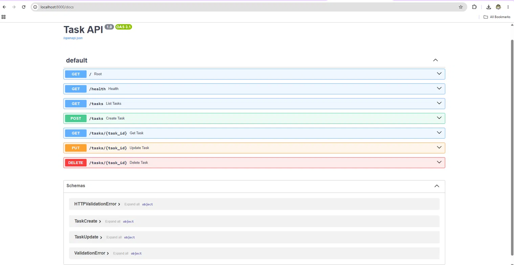

# Task API

A small CRUD API for managing a to-do list, built with **Python 3 + FastAPI**,
now backed by a **SQLite** database instead of an in-memory list.

## How to install & run

```bash
pip install -r requirements.txt
uvicorn main:app --reload
```

The server starts on **http://localhost:8000**.
Interactive docs (Swagger UI) are automatically available at **http://localhost:8000/docs**.

## Database

- **Why SQLite:** it needs no separate server or installation — the whole
  database lives in a single file (`tasks.db`) in the project folder. That
  makes it ideal for a small project like this: zero setup, and the file
  can be committed, copied, or inspected directly.
- **Where it's stored:** `tasks.db`, created automatically in the project
  root the first time the app runs.
- **Auto-setup:** on every startup, the app creates the `tasks` table if
  it doesn't exist yet, and seeds 3 example tasks only if the table is
  empty — so restarting never duplicates data, and a fresh clone of this
  repo works with zero manual setup.

### Schema

```sql
CREATE TABLE tasks (
    id INTEGER PRIMARY KEY,
    title TEXT NOT NULL,
    done BOOLEAN NOT NULL DEFAULT 0
);
```

### Example SQL query

```sql
SELECT * FROM tasks WHERE done = 1;
```
Run in DB Browser for SQLite, this returns only the completed tasks —
confirmed against the live API by hitting `GET /tasks` immediately after
and seeing the same data reflected through HTTP.

### Database viewer screenshot

<!-- Paste a DB Browser screenshot here, e.g. the SELECT * FROM tasks WHERE done = 1 result -->


## Endpoints

| Method | Path          | Meaning                                          |
|--------|---------------|---------------------------------------------------|
| GET    | `/`           | API info (name, version, endpoints)                |
| GET    | `/health`     | Health check → `{"status": "ok"}`                  |
| GET    | `/tasks`      | List all tasks                                     |
| GET    | `/tasks/{id}` | Get one task by id                                 |
| POST   | `/tasks`      | Create a task (`{"title": "..."}`)                 |
| PUT    | `/tasks/{id}` | Update a task's `title` and/or `done`              |
| DELETE | `/tasks/{id}` | Delete a task                                      |

Status codes used: `200` reads, `201` create, `204` delete, `400` invalid
body, `404` unknown id — every error returns `{"error": "message"}`.

## Example: full CRUD cycle via curl

```
$ curl -i -X POST http://localhost:8000/tasks -H "Content-Type: application/json" -d '{"title":"Test SQL update"}'
HTTP/1.1 201 Created
content-type: application/json

{"id":5,"title":"Test SQL update","done":false}

$ curl -i -X PUT http://localhost:8000/tasks/5 -H "Content-Type: application/json" -d '{"done":true}'
HTTP/1.1 200 OK
content-type: application/json

{"id":5,"title":"Test SQL update","done":true}

$ curl -i -X DELETE http://localhost:8000/tasks/5
HTTP/1.1 204 No Content

$ curl -i http://localhost:8000/tasks/5
HTTP/1.1 404 Not Found
content-type: application/json

{"error":"Task not found"}
```

## Swagger UI screenshot



## What changed from Assignment 1

The API surface is identical — same URLs, same request bodies, same
response shapes, same status codes. Only the storage layer changed: task
data now lives in a SQLite file instead of a Python list, which means it
survives server restarts. This is the core idea of separating an API
(what the app does) from its database (where the app keeps its data).
