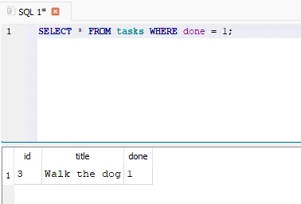

# Task API

A small CRUD API for managing a to-do list, built with **Python 3 + FastAPI**,
backed by a **SQLite** database, and now secured with **Supabase Auth** —
sign up, log in, log out, and protected routes guarded by JWT verification.

## How to set up environment variables

This project needs a Supabase project's credentials to run. Copy the
example file and fill in your own values:

```bash
cp .env.example .env
```

Then edit `.env`:
```
SUPABASE_URL=your_project_url
SUPABASE_KEY=your_anon_key
PORT=8000
```

Get these values from your own [Supabase](https://supabase.com) project:
**Project Settings → API** → copy the **Project URL** and the **anon /
public key**. Never use the `service_role` key here — it bypasses all
security and must stay server-side-only in a real deployment.

`.env` is git-ignored and never committed. `.env.example` is committed
with placeholder values so anyone cloning this repo knows what to set.

## How to install & run

```bash
pip install -r requirements.txt
uvicorn main:app --reload
```

The server starts on **http://localhost:8000** and logs `Server running
and connected to Supabase` if your `.env` is configured correctly.
Interactive docs (Swagger UI) are automatically available at
**http://localhost:8000/docs**.

## Authentication

Auth is handled by **Supabase** as the Identity Provider — this app never
stores passwords or signs tokens itself. The flow:

1. Client sends `email` + `password` to `POST /auth/signup` or
   `POST /auth/login`.
2. Supabase validates the credentials and returns a signed **JWT** (access
   token).
3. The client sends that token on every request to a protected route,
   in the `Authorization: Bearer <token>` header.
4. The server asks Supabase to verify the token (`supabase.auth.get_user`)
   before running the route's logic.

Token verification is implemented once, as a reusable FastAPI dependency
(`get_current_user`), and applied to every protected route — the route
functions themselves never touch auth logic directly.

## Endpoints

| Method | Path                  | Auth required | Meaning                                  |
|--------|-----------------------|:--------------:|-------------------------------------------|
| GET    | `/`                   | No             | API info (name, version, endpoints)        |
| GET    | `/health`             | No             | Health check → `{"status": "ok"}`          |
| POST   | `/auth/signup`        | No             | Create a new user account                  |
| POST   | `/auth/login`         | No             | Authenticate and receive a JWT             |
| GET    | `/public/info`        | No             | Public, open data                          |
| GET    | `/protected/profile`  | **Yes**        | Read the logged-in user's profile          |
| GET    | `/protected/dashboard`| **Yes**        | Second protected route, same auth guard    |
| POST   | `/auth/logout`        | **Yes**        | End the user's session                     |
| GET    | `/tasks`              | No             | List all tasks                             |
| GET    | `/tasks/{id}`         | No             | Get one task by id                         |
| POST   | `/tasks`              | No             | Create a task (`{"title": "..."}`)         |
| PUT    | `/tasks/{id}`         | No             | Update a task's `title` and/or `done`      |
| DELETE | `/tasks/{id}`         | No             | Delete a task                              |

Status codes used: `200` reads/login, `201` create/signup, `204`
delete/logout, `400` invalid input, `401` missing/invalid/expired token,
`404` unknown id — every error returns `{"error": "message"}`.

## Example: auth flow via curl

```
$ curl -i -X POST http://localhost:8000/auth/signup -H "Content-Type: application/json" -d '{"email":"testuser@gmail.com","password":"password123"}'
HTTP/1.1 201 Created
content-type: application/json

{"user": { "id": "...", "email": "testuser@gmail.com", ... }}

$ curl -i -X POST http://localhost:8000/auth/login -H "Content-Type: application/json" -d '{"email":"testuser@gmail.com","password":"password123"}'
HTTP/1.1 200 OK
content-type: application/json

{"access_token": "eyJhbGci...", "refresh_token": "..."}

$ curl -i http://localhost:8000/protected/profile -H "Authorization: Bearer eyJhbGci..."
HTTP/1.1 200 OK
content-type: application/json

{"id": "...", "email": "testuser@gmail.com", "created_at": "..."}

$ curl -i http://localhost:8000/protected/profile -H "Authorization: Bearer eyJhbGci...TAMPERED"
HTTP/1.1 401 Unauthorized
content-type: application/json

{"error": "Invalid or expired token"}
```

## Swagger UI screenshot

Protected routes show a lock icon in `/docs`. Clicking **Authorize** and
pasting a valid access token lets you call any protected route via
"Try it out" without manually setting headers.


## Database

- **Why SQLite:** it needs no separate server or installation — the whole
  database lives in a single file (`tasks.db`) in the project folder. That
  makes it ideal for a small project like this: zero setup, and the file
  can be committed, copied, or inspected directly.
- **Where it's stored:** `tasks.db`, created automatically in the project
  root the first time the app runs.
- **Auto-setup:** on every startup, the app creates the `tasks` table if
  it doesn't exist yet, and seeds 3 example tasks only if the table is
  empty — so restarting never duplicates data, and a fresh clone of this
  repo works with zero manual setup.

### Schema

```sql
CREATE TABLE tasks (
    id INTEGER PRIMARY KEY,
    title TEXT NOT NULL,
    done BOOLEAN NOT NULL DEFAULT 0
);
```

### Example SQL query

```sql
SELECT * FROM tasks WHERE done = 1;
```
Run in DB Browser for SQLite, this returns only the completed tasks —
confirmed against the live API by hitting `GET /tasks` immediately after
and seeing the same data reflected through HTTP.

### Database viewer screenshot



## Example: full CRUD cycle via curl

```
$ curl -i -X POST http://localhost:8000/tasks -H "Content-Type: application/json" -d '{"title":"Test SQL update"}'
HTTP/1.1 201 Created
content-type: application/json

{"id":5,"title":"Test SQL update","done":false}

$ curl -i -X PUT http://localhost:8000/tasks/5 -H "Content-Type: application/json" -d '{"done":true}'
HTTP/1.1 200 OK
content-type: application/json

{"id":5,"title":"Test SQL update","done":true}

$ curl -i -X DELETE http://localhost:8000/tasks/5
HTTP/1.1 204 No Content

$ curl -i http://localhost:8000/tasks/5
HTTP/1.1 404 Not Found
content-type: application/json

{"error":"Task not found"}
```

## What changed across assignments

- **Assignment 1:** in-memory CRUD API.
- **Assignment 2 (Week 3):** swapped the in-memory list for SQLite — same
  API surface, only the storage layer changed, and data now survives
  restarts.
- **Assignment 3 (Week 4, this one):** added Supabase-backed
  authentication. Sign up, log in, and log out are new routes; two
  existing-shaped protected routes now require a valid JWT. The
  task CRUD endpoints themselves are unchanged and remain open — auth
  was layered on top without touching the existing storage code.
